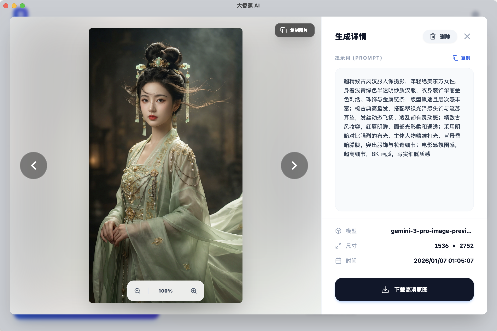
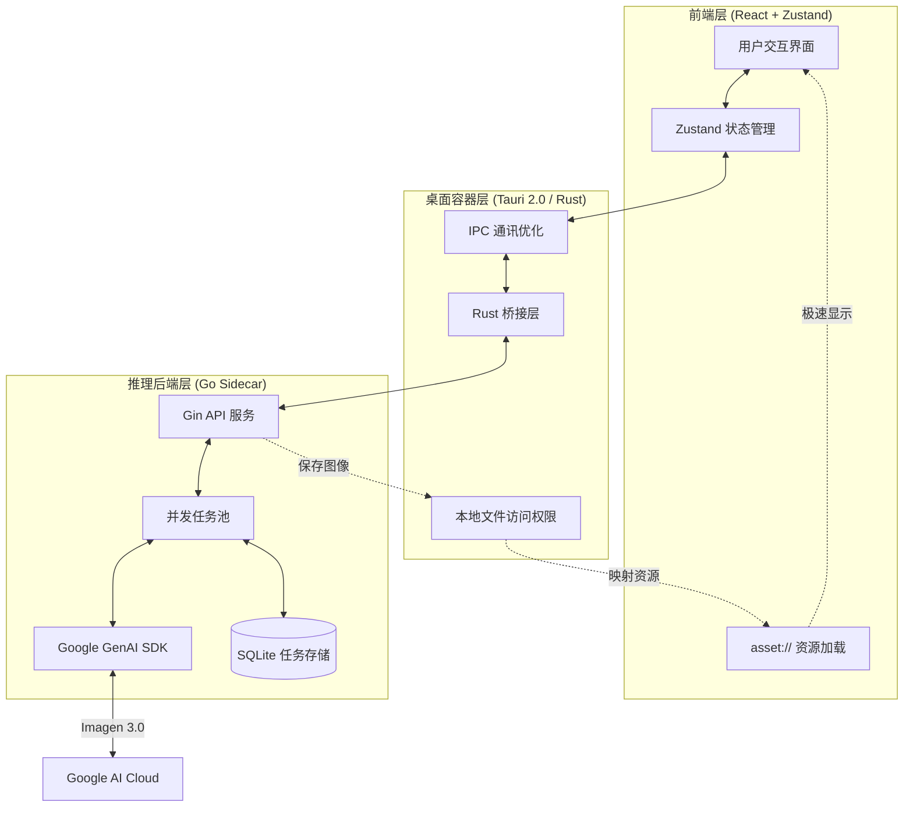

# 🎨 大香蕉 AI (Banana Pro Web & Desktop)

<p align="center">
  
  <br>
  
</p>


**大香蕉 AI** 是一款专为创意工作者打造的高性能图片生成平台。它完美融合了 Google Gemini 的强大 AI 能力与桌面端的原生性能，支持高分辨率（最高 4K）的文生图与图生图功能。

---

## 🌟 核心特性

- **🚀 极致性能**：采用 **Tauri 2.0** 架构，配合 **Go 语言** 编写的高并发 Sidecar 后端，资源占用极低。
- **🖼️ 4K 超清创作**：深度优化 Gemini 3.0 模型，支持多种画幅的 4K 超清图像生成。
- **⚡ 自定义协议 (asset://)**：在桌面端注册原生资源协议，绕过 HTTP 协议栈，本地图片加载速度提升 300%。
- **💾 智能历史管理**：内置本地数据库与持久化缓存，支持任务状态自动恢复与大批量历史记录秒开。
- **📸 精准图生图**：支持多参考图输入，提供细腻的风格与构图控制。
- **📦 自动化交付**：集成 GitHub Actions，实现 macOS (Intel/M1) 与 Windows 平台的自动化打包发布。

---

## 🏗️ 技术架构

### 核心系统流程图


项目采用“三层架构”设计，确保了性能与扩展性的平衡：

1. **前端 (React + Zustand)**：负责响应式 UI 与状态管理，提供流畅的用户交互。
2. **桌面容器 (Tauri)**：作为 Rust 桥梁，处理窗口控制、本地资源访问及 Sidecar 进程管理。
3. **推理引擎 (Go Sidecar)**：负责与 Google GenAI SDK 通讯，处理 Worker 任务池与本地图片存储。

### 核心优化点
- **IPC 负荷优化**：前端与后端之间仅传递文件路径，大型二进制数据通过 `asset://` 协议直接由前端读取。
- **进程生命周期管理**：Tauri 退出时自动清理 Go 边车进程，防止系统资源泄漏。

---

## 📂 项目结构

```bash
├── backend/            # Go 语言编写的推理后端 (Sidecar)
│   ├── cmd/server/     # 服务入口
│   └── internal/       # 核心逻辑 (Gemini 适配器、Worker 池、数据库)
├── desktop/            # Tauri 桌面端项目 (React + Rust)
│   ├── src/            # 前端组件与业务逻辑
│   └── src-tauri/      # Rust 容器配置与系统权限定义
├── frontend/           # 独立 Web 版前端 (保留参考)
└── assets/             # 项目展示资源 (预览图等)
```

---

## 💻 开发者指南

### 1. 环境准备
- **Go**: 1.21+
- **Node.js**: 18+ (建议使用 20)
- **Rust**: 1.75+ (Tauri 构建必备)
- **Google Gemini API Key**

### 2. 后端开发
```bash
cd backend
# 复制并配置 config.yaml 填入您的 API Key
go run cmd/server/main.go
```

### 3. 桌面端开发
```bash
cd desktop
npm install
npm run tauri dev
```

### 4. 自动化构建 (GitHub Actions)
只需推送带有版本号的标签（如 `v0.1.3`），即可触发自动化构建：
```bash
git tag v0.1.3
git push origin v0.1.3
```

---

## ⚙️ 核心配置

| 配置项 | 描述 |
| :--- | :--- |
| `Gemini API Key` | 决定了 AI 生成的配额，请在应用设置或配置文件中填入。 |
| `Storage Dir` | 应用默认将图片保存在系统的 `AppData` (Win) 或 `Application Support` (Mac) 目录下。 |
| `asset://` | 自定义资源协议，用于安全、快速地访问本地生成的图片。 |

---

## 🤝 贡献与反馈

我们欢迎任何形式的贡献！如果您在使用过程中遇到问题，请通过 GitHub Issue 提交。

- **反馈 Bug**：提供详细的复现步骤与系统环境。
- **提交 PR**：请遵循现有的代码风格，并在提交前进行充分测试。

---

## 📄 开源协议

本项目采用 [MIT License](LICENSE) 协议开源。
